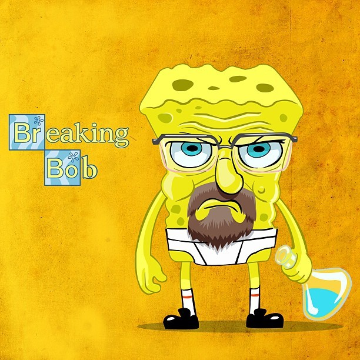

# THE GREAT CF-25 REPOSITORY SAGA: A Play-by-Play Commentary

*Ladies and gentlemen, welcome to the most thrilling git repository story ever told! I'm your host bringing you live coverage of CF-25, where 30+ programming rookies attempt to wrangle HTML, CSS, and Git into submission. Grab your popcorn! <*

---

## THE OPENING CEREMONY (August 14, 2025)

### First Blood: The "Hellow World" Incident
**Commit 9a5bef8** by 12oman (Roman) - *"hellow world initial commit"*

The games begin with Roman stepping up to the plate with a classic rookie move - a README.md file packed with dad jokes and... wait for it... **"HELLOW WORLD"**! 

```markdown
# Hello, World! <
Welcome to the funniest Hello World you'll ever see!

## Why did the computer say "Hello, World!"?
Because it couldn't find the "Goodbye, Universe!" button!
```

*Commentary: Ah, the sweet innocence of a first commit! Roman's going for comedy gold with programming puns. The typo in "hellow" shows he's human - or perhaps he's inventing a new greeting protocol! Either way, the crowd loves the enthusiasm!*

### The Plot Twist: Simplification Station
**Commit 7d82682** by Roman - *"simplify"*

Roman realizes his joke-heavy README might be a bit much. Classic case of "less is more" thinking!

### The Nuclear Option: Fresh Start
**Commit 6e24a59** by Roman - *"fresh start"*

OH MY GOODNESS, FOLKS! Roman has gone full nuclear option! He's deleted the entire README and pivoted to HTML! Look at this beautiful, minimal index.html:

```html
<!DOCTYPE html>
<html lang="en">
<head>
    <meta charset="UTF-8">
    <meta name="viewport" content="width=device-width, initial-scale=1.0">
    <title>Hello, World!</title>
</head>
<body>
    <del><h1>Coding Fundamentals</h1></del>
    <h1>Computational Design</h1>
</body>
</html>
```

*Wait, WAIT! Did you see that? He used a `<del>` tag to cross out "Coding Fundamentals" and replace it with "Computational Design"! This is HTML comedy at its finest! Instead of just deleting the old text, he's showing his work like a true digital archaeologist!*

---

## THE GREAT README CIRCUS (August 21, 2025 - Early Hours)

*And here come the students! Like eager contestants in a digital talent show, they're all piling onto a newly created README.md. Let's watch this beautiful chaos unfold...*

### The Avalanche Begins
**Commit aa6f81b** by francheska - *"Create README.md"*
Francheska fires the starting gun with a fresh README!

**Commits 7564438-2ab6ca1** - The Name Train
- Alllchen adds their name (nice triple L username choice!)
- Francheska adds more content
- More students jump in...
- Roman adds his name and then immediately commits again to fix spelling!

```
2ab6ca1 12oman add name
5408742 12oman update spelling
```

*Classic Roman move - "Ready-fire-aim, commit first, spell-check second! The audience appreciates his honesty!*

### The "Two Truths and a Lie" Tournament
**Commit f6010a9** by Roman - *"2 truths 1 lie"*
Roman starts what appears to be a classroom icebreaker game right in the README!

**Commit fb4ac26** by francheska - *"two truths one lie"*
Francheska follows suit with her own version!

*This is turning into a digital getting-to-know-you session! Students are using version control as their personal diary. Git wasn't designed for this, but hey, it's working!*

### The Commit Storm Intensifies
Between commits bf1477d and 820f0ba, we see a beautiful parade of students adding themselves:
- ben: "Added myself to README.md" (at least he's descriptive!)
- emma parker makes multiple updates
- ELL-IOT22, LordLog123, Batter, SamanthaKirwan, Marama, Captaindeacs123...

*It's like watching a very polite digital stampede! Everyone's taking turns, being considerate, updating one at a time. This is version control etiquette at its finest!*

---

## THE GREAT ARCHITECTURAL REVOLUTION (August 21, 2025 - Afternoon)

### Roman's Master Plan Unveiled
**Commit 470c1eb** by Roman - *"add student placeholders"*

*LADIES AND GENTLEMEN, THE GAME HAS CHANGED! Roman just dropped the most ambitious commit of the day! He's completely transformed that simple HTML into a full student showcase website!*

Look at this architectural masterpiece:

```html
<style>
.student {
    display: block;
    padding: 16px;
    background: #f0f0f0;
    border-radius: 8px;
    text-align: center;
    text-decoration: none;
    color: #333;
}
</style>
```

And then he creates a grid layout with CSS Grid (fancy!) for ALL 32+ students:

```html
<div style="display: grid; grid-template-columns: repeat(auto-fit, minmax(150px, 1fr)); gap: 16px; margin-top: 32px;">
    <a class="student" href="#"><br>Roman</a>
    <a class="student" href="#">Laura</a>
    <a class="student" href="#">Lakshani</a>
    <!-- ...and 29 more students! -->
</div>
```

*Roman has essentially created individual profile slots for every student in the class! This is like building a yearbook website from scratch. The man has vision!*

### The Image Upload Olympics Begin
**Commit 72c44b1** by Roman - *"add students and create issue :)"*

Roman adds his own profile image (`roman.webp`) and makes structural improvements. The ":)" in the commit message suggests he knows chaos is about to ensue!

---

## THE GREAT IMAGE UPLOAD FRENZY

*And here they come! Students have figured out they can upload images! This is like watching digital lemmings, but in the most endearing way possible!*

### The Pioneer Wave
**Commit 2549ab7** by liam - *"breakingbob"*
Liam uploads `breakingbob.jpg` - apparently a Breaking Bad reference? This kid has taste!

**Commit 6eb7662** by LordLog123 - *"Add files via upload"*
LordLog123 (Logan) uploads `FreakBob.jpeg` - another Bob reference! Is there a Bob theme emerging?

**Commit 5ff990b** by Captaindeacs123 - *"Add files via upload"*
Deacon uploads `deacon.dexter` - no file extension! Bold choice, or accidental? We love the confidence!

**Commit b339247** by Marama - *"Add files via upload"*
Marama uploads `imgmarama.jpg` - at least it's clearly labeled!

### The HTML Update Marathon
*Now comes the real fun - students trying to figure out how to get their images to show up on the website! This is where things get beautifully chaotic - like watching abstract digital art emerge from pure determination.*

## 🎨 THE GLITCH ART GALLERY: Beautiful Learning Moments

### Emma's Bold First Strike (Commit 68bf3c1)
Emma courageously makes the first HTML edit, and it's... wonderfully experimental:

```html
<a class="student" href="#">Emma</a>
```

*Emma discovers that HTML structure matters! She's trying to add an image but places it outside the student div, creating a floating grapefruit slice image. The alt text suggests she might be copying from a tutorial about fruit - classic beginner move of adapting example code! This is the HTML equivalent of experimental poetry.*

### Logan's Minimal Mastery (Commit 3430577)
Logan (LordLog123) takes a different approach:

```html
<a class="student" href="#">Logan</a>
<a><div class="student">Logan</div></a>
```

*Beautiful! Logan creates a duplicate entry but gets the structure right. He understands that the image needs to go inside the div, and he's nailed the syntax. This is learning through pattern recognition - he's seen the structure Roman created and replicated it perfectly.*

### Liam's CSS Surgery Gone Wild (Commit 8b0c87e)
Liam attempts some... ambitious in-line CSS surgery:

```html
<a class="student" href="#">Liam</a>
<!-- <a class="student" href="#">Liam</a> -->
  <a><div class="student">Liam</div></a>
<style>
    .student {
        display: block;
        padding: 16px;
        background: #f0f0f0;
        border-radius: 8px;
        text-align: center;
        text-decoration: none;
        color: #333;
    <a class="student" href="#">Zoe</a>
```

*OH MY! Liam has attempted to inject CSS styles directly into the middle of the HTML structure, but forgot to close the CSS block! He's created a magnificent glitch where CSS rules bleed into HTML elements. This is like watching someone try to renovate their house while still living in it. The commented-out line shows he's experimenting with different approaches - true iterative development!*

### Liam's CSS Archaeology Continues (Commit ff37f60)
Not deterred, Liam tries again with even more experimental CSS placement:

```html
<a><div class="student">Liam</div></a>
/* make images fit their parent */
    .student img {
        width: 100%;
        height: auto;
        border-radius: 8px 8px 0 0;
}
<style>
    .student {
        display: block;
```

*Liam has discovered CSS comments but is placing CSS rules in the middle of HTML! He's trying to copy the existing image styles but hasn't quite grasped where CSS should live. This is JODI-esque digital art - CSS floating in HTML space, creating beautiful broken syntax. He understands WHAT he wants (responsive images) but not quite WHERE to put it.*

### Lakshani's Mysterious Coordinates (Commit 2f62f44)
Lucky060701 (Lakshani) creates the most enigmatic commit:

```html
<a class="student" href="#">Lakshani</a> x=5.0,y=4.7
<a class="student" href="#">Marama</a>
```

And later in the same commit:
```html
<a class="student" href="#">Lakshani</a> https://raw.githubusercontent.com/12oman/cf-25/refs/heads/main/roman.webp
```

*Lakshani has entered the realm of digital mysticism! First he's added coordinate data (x=5.0,y=4.7) - possibly from a design program? A gaming background? The raw GitHub URL suggests he's discovered how to link to the actual file location. This is like finding coordinates to a treasure map mixed with a direct link to the treasure. Poetic and practical!*

### Deacon's File Extension Adventure (Commit c0a5436)
```html
<a class="student" href="#">Deacon</a>
<a><div class="student">Deacon</div></a>
```

*Deacon commits to his mysterious `deacon.dexter` filename (no extension, maximum mystery) but accidentally labels his alt text as "Liam"! This is the HTML equivalent of signing someone else's name on your artwork. Beautiful human error in digital space.*

### Millie's CSS Archaeology (Commit 915f7cd)
Millietaylor01 becomes the CSS detective, uncommenting styles:

```css
/* make images fit their parent */
.student img {
    width: 100%;
    height: auto;
    border-radius: 8px 8px 0 0;
}
```

*Millie discovers commented-out CSS and brings it back to life! She's reading the code like an archaeologist, understanding that the commented styles should be active. This shows remarkable code comprehension - she's not just adding her image, she's improving the entire site's functionality.*

## 🔬 LEARNING PATTERN ANALYSIS

**The Evolution of Understanding:**
1. **Structure Discovery**: Students learn that images need to go inside specific HTML elements
2. **CSS Confusion**: Multiple attempts to add styles in incorrect locations
3. **Pattern Recognition**: Successful students copy and modify existing working code
4. **Iterative Improvement**: Each commit builds understanding, even when it doesn't work
5. **Collaborative Learning**: Later commits show students building on others' discoveries

**Beautiful "Failures" That Teach:**
- CSS rules floating in HTML space (teaching: CSS belongs in `<style>` tags)
- Images outside their containers (teaching: HTML structure matters)
- Mysterious coordinates and URLs (teaching: experimentation is valuable)
- Wrong alt text (teaching: attention to detail matters)
- Unclosed tags (teaching: syntax precision is crucial)

*This is authentic learning captured in version control! Every "mistake" is a learning moment, every glitch is understanding in progress. This is what real education looks like - not perfect code, but the messy, beautiful process of discovery.*

### The Learning Curve in Action
Students are exhibiting classic beginner behavior:
1. **Upload image with creative filename**
2. **Make 3-4 attempts to update HTML**
3. **Discover CSS exists and try to modify it**
4. **Success! (usually)**
5. **Sometimes one more commit "just to be sure"**

*The commit frequency tells the story - some students nail it in one try, others need multiple attempts. This is authentic learning in real-time, preserved forever in git history!*

### The Standardization Movement
**Commit 2017a13** by Roman - *"standardise form"*

*Roman comes back like a benevolent dictator to clean up the formatting! He's probably looking at the HTML and thinking "What have they done to my beautiful grid layout?!" But there's love in that standardization.*

**Final commits 7455c31, 3cb5881, c853338** - The cleanup continues
- Marama makes final adjustments
- Roman renames images (probably to match the expected filenames)
- Roman corrects spelling (because of course he does!)

---

## FINAL ANALYSIS: WHAT WE WITNESSED
### The Technical Play-by-Play:
1. **Repository Born**: Simple README with humor
2. **Platform Pivot**: README --> HTML transformation
3. **Architecture Phase**: Complete student gallery layout created
4. **Content Upload**: Students add personal images
5. **Integration Struggles**: Multiple attempts to connect images to HTML
6. **Collaborative Success**: Everyone (who tried) gets their image displayed
7. **Cleanup Phase**: Standardisation and optimisation

### The Human Drama:
- **Roman**: The benevolent teacher/leader, setting up infrastructure and cleaning up afterwards
- **Early Adopters** (Emma, Liam): Brave souls making the first HTML edits
- **Image Pioneers** (Logan, Deacon, Marama): First to upload profile pictures
- **The Followers**: Everyone else jumping in once they saw it was safe
- **The Persistent** (Luke with lucky060701): Multiple commits showing determination

### Beautiful Rookie Mistakes:
- Typos in commit messages ("hellow world")
- Creative file naming (`deacon.dexter`, `FreakBob.jpeg`)
- Multiple commits for single logical changes (learning git incrementally)
- Using `<del>` tag as version control instead of just deleting text

### What They Got Right:
- **Collaboration without conflicts**: 30+ people editing the same repo with minimal issues
- **Incremental progress**: Small, manageable commits
- **Descriptive commit messages**: "Add files via upload", "Update index.html"
- **Persistence**: Not giving up when first attempts failed
- **CSS Grid mastery**: Someone (Roman) created a responsive grid layout

---

## THE FINAL SCORECARD

**Most Creative Filename**: `FreakBob.jpeg` by LordLog123  
**Most Commits by Single Person**: Liam (persistence award!)  
**Best Infrastructure Planning**: Roman (the unsung hero)  
**Most Mysterious File**: `deacon.dexter` (we may never know what extension it should have been)  
**Cleanest Process**: Marama with `imgmarama.jpg`  
**Most Wholesome**: Everyone helping each other by not stepping on each other's commits  

*And there you have it, folks! CF-25: A repository where 30+ programming newbies successfully created a collaborative student gallery website using HTML, CSS, Git, and pure determination. No merge conflicts, no broken code, just beautiful beginner chaos that somehow worked perfectly!*

**Final Score: Students 1, Code Complexity 0**

---

## 📚 REFLECTION SECTION: Learning from the Glitch Art

*Hey CF-25 students! When you come back to read this, here are the golden learning moments from your beautiful chaos:*

### 🎯 What Your "Mistakes" Actually Taught You

**Emma's Grapefruit Experiment** showed that:
- HTML elements need to be properly nested
- You can't just drop images anywhere
- Copying from tutorials requires adaptation, not just copy-paste

**Liam's CSS Adventures** revealed:
- CSS has a specific place to live (inside `<style>` tags or external files)
- CSS syntax is different from HTML syntax
- Commenting out code (`<!-- -->`) is a smart debugging technique
- Persistence pays off - keep experimenting!

**Lakshani's Mysterious Coordinates** demonstrated:
- Code doesn't have to be perfect to be meaningful
- Experimentation leads to discovery (you found the raw GitHub URL!)
- Every attempt teaches you something new about how web tech works

**Logan's Pattern Recognition** proved:
- Understanding structure is more important than memorizing syntax
- Looking at working examples and adapting them is a valid learning strategy
- Sometimes the simplest approach is the best approach

**Millie's CSS Detective Work** showed:
- Reading and understanding existing code is a crucial skill
- Uncommenting code is sometimes the solution
- You can improve everyone's experience by fixing shared styles

### 🔧 Technical Lessons Hidden in Your Commits

1. **HTML Structure Matters**: Elements need to be properly nested and closed
2. **CSS Belongs in Specific Places**: Not floating randomly in HTML
3. **Alt Text Should Be Accurate**: It helps accessibility and debugging
4. **File Extensions Matter**: `.jpg`, `.png`, `.webp` tell browsers what to expect
5. **Pattern Recognition is King**: Find what works, then adapt it
6. **Version Control Saves Everything**: Every experiment is preserved for learning

### 💡 The Meta-Learning: What You Really Accomplished

You didn't just add images to a website. You:
- **Learned by doing** (the best way to learn programming)
- **Collaborated without conflicts** (30+ people, zero merge issues!)
- **Iterated and improved** (multiple commits showing growth)
- **Experimented fearlessly** (tried things even when unsure)
- **Built on each other's work** (true collaborative development)
- **Preserved your learning journey** (git history as learning artifact)

### 🚀 What This Prepares You For

These "glitchy" moments are exactly what real programming looks like:
- **Debugging**: Finding and fixing CSS that's in the wrong place
- **Code Review**: Understanding what other people's code does
- **Refactoring**: Cleaning up working code to make it better
- **Documentation**: Understanding why someone made certain choices
- **Collaboration**: Building on each other's work without breaking things

### 🎭 The JODI Connection

Your accidental "glitch art" connects to the work of legendary net artists JODI, who showed that broken code can be beautiful and meaningful. Your CSS floating in HTML, your mysterious coordinates, your experimental file extensions - these aren't failures, they're authentic expressions of learning in digital space.

*Remember: Every expert was once a beginner who made beautiful mistakes. Your code experiments today are the foundation of your programming expertise tomorrow.*

---

*This has been your play-by-play commentator, signing off. Remember: every expert was once a beginner, and every beautiful codebase started with someone typing "hellow world" and hitting commit!*